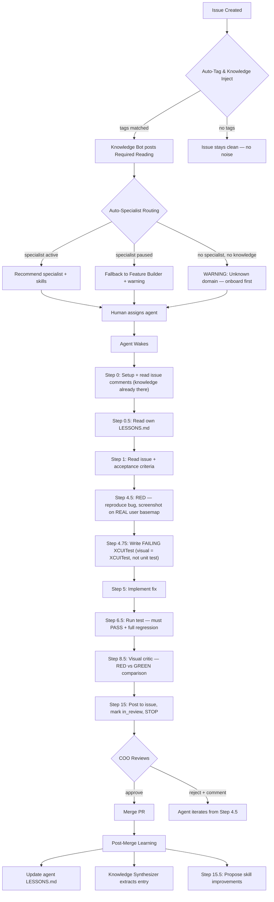

# MCM Forge — Factory Workflow

> **Single source of truth** for how issues move through the factory. Updated every time the pipeline changes. Git history = changelog proof.

---

## The Pipeline

---

## Pipeline Steps — Detail

### Step 1: Issue Creation — Auto-Tag + Knowledge Injection
**Status: LIVE (Apr 15, 2026)**

When any issue is inserted into `forge.issues`, a Postgres trigger:
1. Scans `title + description` for domain keywords (15 categories, 80+ keywords in `forge.tag_keywords`)
2. Scans for file path patterns (`forge.file_tag_mappings`)
3. Tags the issue (`UPDATE issues SET tags = matched_tags`)
4. Queries `forge.knowledge` for entries matching those tags (proven first, max 5)
5. Posts a "Required Reading" comment as Knowledge Bot (`author_user_id = 'system'`)

**If no tags match:** No comment, no noise.
**Error handling:** EXCEPTION block — never blocks issue creation. Errors logged to `forge.trigger_errors`.

**Tables:** `forge.tag_keywords`, `forge.file_tag_mappings`, `forge.trigger_errors`
**Trigger:** `trg_auto_knowledge_inject` → `fn_auto_knowledge_inject()`
**Spec:** `docs/superpowers/specs/2026-04-15-auto-knowledge-injection-design.md`

---

### Step 2: Specialist Routing — Auto-Recommend Agent
**Status: LIVE (Apr 15, 2026)**

Extends the trigger to add a second comment recommending the right specialist:

| Case | What happens |
|------|-------------|
| Specialist active | "Recommended: [Agent Name]" + agent ID + matched tag + priority |
| Specialist paused | "Specialist Paused — Fallback to Generalist" + activation SQL + fallback ID |
| No specialist, has knowledge | "No Specialist — Generalist with Knowledge" + onboarding suggestion |
| No specialist, no knowledge | "WARNING: Unknown Domain" + 3-step remediation checklist |

**Table:** `forge.tag_agent_mappings` (14 tag→agent mappings, priority-ranked)
**Trigger:** Extended `fn_auto_knowledge_inject()` — routing runs after knowledge injection
**Tested:** Map issue → Map Rendering Expert (paused) → Case 2 with activation instructions

---

### Step 3: Agent Wake — Knowledge Already There
**Status: LIVE (via dirtsync-issue-to-ship.md skill)**

Agent reads the issue and finds:
1. **Comment 1 (Knowledge Bot):** Required Reading with 1-5 knowledge entries
2. **Comment 2 (Knowledge Bot):** Recommended specialist + skills
3. Agent reads own `LESSONS.md` from agent directory
4. Agent reads acceptance criteria from the issue

No more cold starts. No more choosing wrong search tags.

---

### Step 4: TDD on Real User Environment
**Status: ENFORCED (Apr 15, 2026 — skill update)**

Rules added to `dirtsync-issue-to-ship.md`:
- Visual features MUST use XCUITest, not unit tests
- Tests MUST run on the ACTUAL default basemap (satellite, not offline)
- Config checks (`minimumZoomLevel == 10`) are NOT acceptable — must verify rendering
- RED screenshot required BEFORE fix, GREEN screenshot AFTER

---

### Step 5: Quality Gates
**Status: PARTIALLY LIVE**

| Gate | Status | How |
|------|--------|-----|
| Knowledge injected | LIVE | Auto-trigger on creation |
| Specialist recommended | DESIGNED | Auto-trigger extension |
| RED/GREEN screenshots | ENFORCED | Skill requirement |
| XCUITest passes | ENFORCED | Skill requirement |
| Full regression passes | ENFORCED | Skill requirement |
| COO reviews | LIVE | Step 15 in skill |
| Real device verification | MANUAL | Steve field tests |

---

### Step 6: Post-Merge Learning
**Status: PARTIALLY LIVE**

| Component | Status |
|-----------|--------|
| Knowledge Synthesizer (auto-trigger on review events) | LIVE |
| Agent LESSONS.md update | ENFORCED in skill |
| Step 15.5 skill improvement proposals | ENFORCED in skill |
| Cross-agent lesson sharing | NOT BUILT |
| Tag new knowledge entries | LIVE (auto-tagging) |

---

## Key Rules (Hard)

1. **No cold starts.** Every issue gets knowledge before anyone touches it.
2. **Specialists for specialist work.** Map issues → Map Rendering Expert. HUD issues → Nav HUD Expert. Generalist is the fallback, not the default.
3. **Test what the user sees.** Satellite basemap, not offline. XCUITest, not unit test. Pixels, not config.
4. **No victory without proof.** RED/GREEN screenshots. XCUITest passing. Real device verification.
5. **Every failure becomes knowledge.** LESSONS.md updated. Knowledge base entry created. Skill patched. Same bug never repeats.
6. **Unknown domain = stop and onboard.** Don't send a generalist into a domain with no specialist and no knowledge.

---

## Agents — Current Roster (DirtSync)

| Agent | Domain | Status | Tags Covered |
|-------|--------|--------|-------------|
| Feature Builder | Generalist / coordinator | idle | trail-detection, ride-recording, gpx, ferrostar, valhalla, ios, difficulty |
| Map Rendering Expert | MapLibre, basemap, tiles, styles | paused | maplibre, map-rendering, satellite, zoom |
| Nav HUD Polish Expert | HUD, navigation, turn cards | paused | hud, navigation |
| Explore UX Expert | POI, explore view, search | paused | poi |
| iOS Builder | Build + deploy | paused | — |
| Test Runner | Test execution | paused | — |
| QA Recorder | Video QA | paused | — |

---

## Knowledge Base Stats

- **32 entries** (26 proven, 3 suspected, 3 disproven)
- **15 tag categories** with 80+ keywords
- **11 file pattern mappings**
- **Auto-injection:** live on every new issue
- **Auto-synthesis:** Postgres trigger on review_approved/review_rejected events

---

## Changelog

All workflow changes, newest first. Each entry = one shipped improvement.

### 2026-04-15 — Auto-Specialist Routing (LIVE)
**What:** Extended the auto-knowledge trigger to recommend the right specialist agent based on issue tags. Four cases: specialist active, specialist paused (with activation SQL), no specialist but knowledge exists, unknown domain warning.
**Why:** DIRA-177 was assigned to Feature Builder (generalist) instead of Map Rendering Expert (who already knew about async style loading and glyphs). The system now tells you who to assign and warns when the specialist is paused.
**Table added:** `forge.tag_agent_mappings` (14 mappings across 4 agents)
**Trigger:** Extended `fn_auto_knowledge_inject()` with routing logic after knowledge injection
**Tested:** Map issue correctly identified Map Rendering Expert (paused) and provided activation instructions + Feature Builder fallback.

### 2026-04-15 — Auto-Knowledge Injection (LIVE)
**What:** Postgres trigger on issue creation auto-tags issues and posts matching knowledge base entries as a Required Reading comment.
**Why:** DIRA-177 exposed that agents don't search knowledge before starting. The glyphs URL knowledge existed but nobody read it. Now knowledge comes to the issue automatically.
**Trigger:** `trg_auto_knowledge_inject` on `forge.issues` INSERT
**Tables added:** `forge.tag_keywords`, `forge.file_tag_mappings`, `forge.trigger_errors`
**Column added:** `tags text[]` on `forge.issues` with GIN index
**Dashboard:** Knowledge Bot system author with gray avatar
**PR:** golfballnut/mcmforge#52
**Tested:** 3 test cases — map issue (5 entries injected), ride issue (different entries), generic issue (no noise)

### 2026-04-15 — XCUITest Enforcement for Visual Features
**What:** Updated `dirtsync-issue-to-ship.md` skill to require XCUITest for visual features. Config-checking unit tests explicitly forbidden.
**Why:** 50 tests passed but labels were invisible. `testTrailLabels_MinimumZoomLevel_Is10` checked a constant, not rendering. `hideBasemapClutter` zeroed textOpacity after config was set.
**Rule:** "For ANY visual feature, your test MUST be an XCUITest that launches the app, navigates to the screen, and asserts the element is ACTUALLY VISIBLE on screen."

### 2026-04-15 — Test on Real User Basemap
**What:** Added rule that tests must exercise the ACTUAL default basemap (satellite), not the offline dark-green basemap.
**Why:** DIRA-177 XCUITest passed on offline basemap but labels were invisible on satellite because `mapbox-satellite-style.json` was missing the `glyphs` URL. The test proved nothing about the user experience.
**Memory:** `feedback_test_actual_default_basemap.md`

### 2026-04-15 — DIRA-177 Shipped (Labels Visible)
**What:** Fixed `hideBasemapClutter` whitelist + missing glyphs URL in satellite style JSON.
**Root causes:** (1) `system-name-labels` layer caught by "label"/"name" keyword cleanup. (2) `mapbox-satellite-style.json` missing `glyphs` URL — only style without it.
**Knowledge entries added:** 2 (visibleFeatures MLNShapeSource gap, glyphs URL requirement)
**PR:** golfballnut/DirtSync#402

### 2026-04-15 — v1.2 TestFlight Readiness
**What:** 50-test suite, 9 PRs merged (#393-401), App Store removed, TestFlight planned.
**Blockers resolved:** DIRA-159 (POI), DIRA-168 (road detection, 5 iterations), DIRA-169 (trailhead suppression), DIRA-170 (banner disabled), DIRA-173 (beacon position), DIRA-175 (search bar hidden), DIRA-176 (Explore tab hidden + trail labels z10+), DIRA-177 (labels whitelist + glyphs)

### 2026-04-14 — Knowledge System Shipped
**What:** `forge.knowledge` table, Knowledge page with URL ingestion, auto-tagging, auto-synthesis trigger on review events.
**Tables:** `forge.knowledge` (GIN index on tags), `forge.issue_events`
**Dashboard:** Knowledge page, inline comment attachments, sub-issues, activity timeline, interactive acceptance criteria

### 2026-04-13 — Visual TDD Added to Skill
**What:** Steps 4.5 (RED screenshot), 4.75 (failing test first), 8.5 (visual critic RED vs GREEN) added to dirtsync-issue-to-ship.md.
**Why:** Agents claimed victory without visual proof. GPX tracks had straight lines. Screenshots showed bugs that passing tests missed.

### 2026-04-13 — Self-Improving Skills (Step 15.5)
**What:** After completing an issue, agents propose skill improvements if they overcame an undocumented obstacle. Stolen from Hermes Agent patterns.
**Why:** Skills should get better with every issue, not stay static.

### 2026-04-12 — Drill Loop Proven
**What:** First autonomous PR shipped (#46). 4 commits, 12 iterations. drill.sh → issue → TDD → PR → merge.
**Lesson:** Sonnet without learnings = B+. With learnings = A. ~$1/feature.
